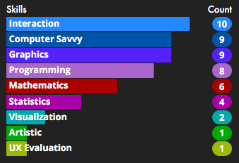
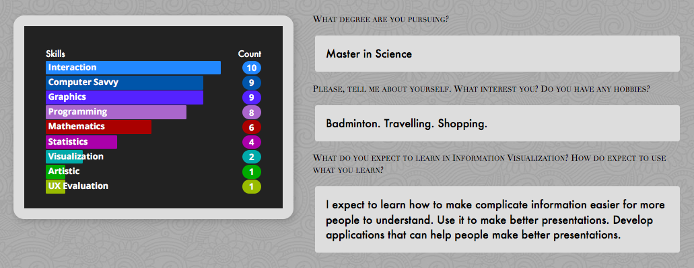

# IVIS16Survey
### Repository
There is a GitHub repository for this project at:

 <https://github.com/RodrigoRoaRodriguez/IVIS16Survey/>

### Live demo
You can check the live demo at:

<http://rodrigoroarodriguez.github.io/IVIS16Survey/>

### What is this?
The first practical assignment in the course IVIS16 is visualize data from a personal survey in order to form project-groups.

With that goal in mind, I considered the following three to be necessary:

1. A graphical representation of a person's different skills.
2. The answers they gave to the other questions and what these questions were.
3. A way to sort the values in order to find extrema in the data.

As a solution to the first requirement I suggest a bar chart, due to relative-lenght being easily perceivable. Additionally, since since all these questions consisted of discrete ordinal data from 1 to 10, an appropriate scale suitable for all values exists.

Regarding the second requirement I matched every question with it's corresponding answer and displayed them on the right of the bar chart. Since reading order is left to right this is so that they can be read after assessing the chart, which is the main content of the entry.  

Third and last, in this case the purpose of finding extrema is not only to find at **which skill** every individual is talented at but also identify individuals of **high skill**. So not only are the individual skills sorted after value, but the students themselves are sorted after a specified skill:

